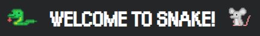
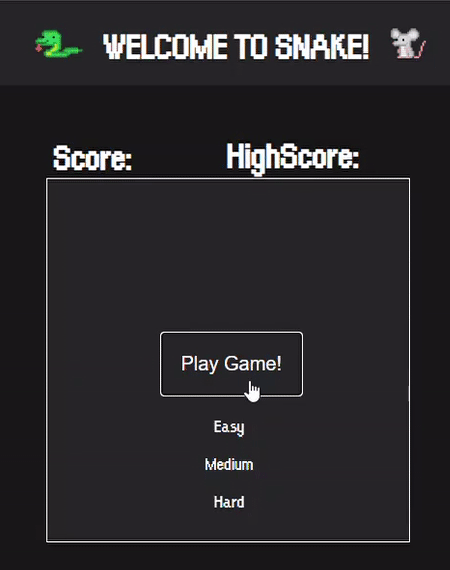

# Snake-Game
#### Code Institute Interactive Front-end Web Development Project
 
<p align="center">
  
</p>
 
<p align="center"><a href= 'https://aidant842.github.io/MSP2/'>
Play Snake!</a></p>
 
## Table of Contents
 
- [**About**](#About)
- [**Demo**](#Demo)
- [**UX**](#UX)
    - [User Stories](#User-Stories)
  - [Research](#Research)
  - [Wireframes](#Wireframes)
  - [Design](#Design)
- [**Features**](#Features)
    - [Functionality](#Functionality)
    - [Existing features](#Existing-features)
    - [Future features](#Future-features)
- [**Technologies used**](#Technologies-used)
- [**Testing**](#Testing)
    - [Manual testing](#Testing)
    - [Errors](#Errors)
- [**Code Notes**](#Code-Notes )
- [**Deployment**](#Deployment)
- [**Credits**](#Deployment)
    - [Code](#Code)
     - [Images](#Images)
     - [Audio](#Audio)
- [**Acknowledgements**](#Acknowledgements)
- [**Disclaimer**](#Disclaimer)
## About
 
The purpose of this project was to build a single application using mobile first design.
I decided to build a game, the game i chose to replicate was the classic [Snake!](https://en.wikipedia.org/wiki/Snake_(video_game_genre))
This is a fantastic, nostalgic game for many people.<br>
Snake was a classic arcade game, which first emerged in 1976 as [Blockade](https://en.wikipedia.org/wiki/Blockade_(video_game)).
 
I really enjoy playing video games, as do many video games provide a great source of entertainment and enjoyment, which I believe is important.
Especially in the times we currently find ourselves in, many people can't leave the house due to the [coronavirus (COVID-19)](https://en.wikipedia.org/wiki/Coronavirus_disease_2019) outbreak.
This is what spurred me on to make a game that my friends and family could enjoy.
 
## Demo
EZGif
<p align="center">
  
</p>
 
## UX
### User Stories
 
* I want to play a game to keep me entertained.
* I want the game to be nostalgic/old-school.
* I want to be able to play on different difficulties.
* I want some sort of audio feedback when an action happens.
* I want to be able to play the game on my mobile.
* I want to keep track of my high score.
 
### Research
 
To decide what i wanted my game to look like i downloaded a few versions of snake off the google play store.
There are many versions of snake, some classic, and some modern. I favoured the classic look as this is the way i remember playing the game on the old Nokia phones. This corresponded with feedback I got from family and friends. 
 
I didn't find a version of the game where the snake eats a mouse, most eat apples, so I decided to change it up a bit and have the snake eat mice.
 
Some versions of Snake allow the user to pass through the game board barriers, i decided not to allow this as i prefer the extra difficulty added by having the game end when the snake hits the border.
 
### Wireframes
 
* I first made a basic design for mobile and tablet as this is where most of my expected users would be playing the game.
[Mobile-Wireframe](assets\wireframes\snakeWireFrameMobile.bmpr) [Tablet-Wireframe](assets\wireframes\snakeWireFrameTablet)
 
* I then made a basic design for laptops [Desktop-Wireframe](assets\wireframes\snakeWireFrame)
 
### Design
The design of this page is purposely basic and oldschool to give a nostalgic feeling.
 
I did this by using old school fonts, basic dark colours, a small effective game area and an old school arcade like font.
 
There are a very few modern aspects of the page, these being the snake and mouse images, however I found some coloured old school looking images I wanted to use.
 
For mobiles I added an image of directional keys from an old school mechanical keyboard to control the snake.
 
 
## Features
### Functionality
 
* The Game begins by the user clicking the play game button and selecting a difficulty.
* The snake moves by using the directional arrows (on-screen for mobile).
* The cursor changes to a pointer when the user hovers over the play game button.
* The snake grows in length each time it eats a mouse.
* When the game ends you are presented with the play game button again, and play is disabled until a difficulty is selected.
* The game ends when the snake eats itself (when the head hits into any other part of its body).
* The game ends when the snake goes out of the boundaries.
* Audio plays when the snake changes direction, eats and when the game ends.
* The default functionality of the arrows keys was disabled to improve UX.
* It is not possible for the snake to turn back on itself (e.g the snake can't go down when traveling up)
* The game keeps track of your current score, and also keeps track of your highscore.
 
###  Future updates
 
-  **More mobile friendly** possibly use swipes of finger instead of the arrow buttons.
-  **Disable Audio** Add a mute button to disable sounds for anyone who may find it irritating.
-  **HighScores** Store a high score in local storage so your highscore stays rather than resetting every time you visit the page, also maybe implementing a highscore board where users can view others highscores.
 
## Technologies used
Below I have listed the programming languages, technologies, frameworks and resources used for this project.
 
* **HTML5**
* **CSS3**
* **Vanilla JS**
* **Markdown**
* **Visual Studio Code** development environment (GitHub was having issues when i was building this project so i decided to use VS Code for most of the development - i also used the liver server extension)
* **Git** for version control
* **Github** to hold my project
* **Github pages** to deploy my project to the web.
* **[DaFont](https://www.dafont.com/)**
* **Google Chrome/FireFox/Edge/Safari** 
* **Developer tools for chrome**
* **[Balsamiq](https://balsamiq.com/)** to create wireframes
* **Screen Recorder** windows 10 built in screen recorder - shortcut (win + G)
* **[Freesound.org](https://freesound.org/)**
* **[EZGIF](https://ezgif.com/video-to-gif)** to trim, crop and convert video to GIF format for my ReadMe file
* **[W3Schools](https://www.w3schools.com/)** for help with some javascript issues i ran into
* **[StackOverFlow](https://stackoverflow.com/)** for help with some javascript issues i ran into
* **Mentor** my code institute mentor for advice
* **[Slack](https://slack.com/)** specifically the code institute room in slack
* **[Piskel](https://www.piskelapp.com/)** to create sprites.
* **[Grammarly](https://www.grammarly.com/)** to correct grammar and spelling mistakes.
 
## Testing
* [HTML validator](https://validator.w3.org/#validate_by_input)
* [CSS validator](https://jigsaw.w3.org/css-validator/#validate_by_input)
* [JsHint](https://jshint.com)
* Testing [checklist](https://geteasyqa.com/qa/test-website/)
 
I used DevTools breakpoints to debug any JavaScript errors I encountered. During the development process I used  ```console.log()``` alot to check parts of my code were working correctly or functions were being called when they were supposed to be.
 
I personally tested the game on some of my own personal systems of which include:
 
* MSI gaming laptop running windows 10 
* Acer aspire windows 7 laptop
* HP Windows Vista desktop
* Custom built windows 7 high-end Gaming Desktop
* Samsung galaxy s5/s6/s7/s9 (Android) phones
* Samsung Galaxy Tab A Tablet (Android).
 
The game performed as expected on all of my personal devices, apart from when using firefox (Audio issues) which was encouraging.
 
I also asked family and friends to test my game on their devices, all was well apart from apple users (Audio issues again)
 
### Manual testing
* Making sure the game doesn't begin until a difficulty is selected. &#9745;
* Testing each difficulty ensuring each works as expected. &#9745;
* Test to make sure snake can't turn back on itself &#9745;
* Eating Mouse to ensure the snake grows in length. &#9745;
* Eat a mouse to ensure score increments correctly &#9745;
* Test death works correctly by trying to go out the canvas on any side &#9745;
* Test death works correctly when the snake collides with itself &#9745;
* Ensure the player is prompted to play again upon death &#9745;
* Die on purpose to ensure high score gets assigned the correct value &#9745;
* Get a lower score to make sure highscore doesn't get overridden by the current score &#9745;
* Ensure sounds play when changing snake direction, eating a mouse, and gameover.(issue with FireFox and Safari) &#9745;
* Checking there are no grammar and spelling mistakes &#9745;
* Gameplay instructions are simple and precise. &#9745;
* Testing mobile controls appear when under 1025px(Ipad Pro) wide &#9745;
* Test responsiveness on other screen sizes. &#9745;
* Test mobile controls to ensure they work correctly. &#9745;
* Tested game on lower spec machines to ensure it still plays as expected &#9745;
 
I had planned to use Jasmine for automated testing but due to time constraints I was not able to. Yet.
 
### Errors
Current errors:
 
1. ***NOT YET FIXED*** Sounds not playing correctly for FireFox and Safari users. (partially fixed, still occurs on lower powered machines for both browsers)
2. ~~***NOT YET FIXED***  Sounds don't play correctly when using the mobile controls.~~ 
3. ***NOT YET FIXED***  Snakes head does not rotate correctly with players movements.
4. ~~***NOT YET FIXED***  Mouse is able to spawn on snakes current position~~
5. ***NOT YET FIXED***  Snake is able to turn back on itself if you change direction rapidly.
6. ***NOT YET FIXED*** Mouse is able to spawn in the same location multiple times.
7. ***NOT YET FIXED*** Issue with game ending "randomly". (know the source of the issue, need to think of a fix)
8. ***NOT YET FIXED*** HighScore now saves to localStorage, however on refresh, localStorage can be overridden.
## Code Notes 
 
I tried to make the game as easily playable as possible on mobiles, given my current knowledge and skills this was the best solution i could think of, i think it suffices but not the best solution. 
 
 In this project I decided not to use any external libraries, I did this so I could get a good understanding of the languages I used.
 
## Deployment
To deploy this project I used github pages.
* Settings
* GitHub Pages
* Source -> Master Branch
 
 
### How to deploy code locally:
paste this into your console:
 
git clone https://github.com/aidant842/MSP2.git
 
## Credits
### Code
* Drop down play game button [here](https://www.w3schools.com/howto/howto_js_dropdown.asp)
* A tutorial i watched [here](https://www.youtube.com/watch?v=9TcU2C1AACw&t=900s)
 
### Images
* [Snake and Mouse](https://www.shutterstock.com/)
* [Arrow Keys](https://www.google.com/imghp?hl=en)
 
### Audio
* [Audio clips](https://freesound.org/)
 
## Acknowledgements
 
A thank you to my friends and family for testing the game for me.
Also a thank you to my mentor for the help and support.
 
[Back to top ↑](#Snake-Game)